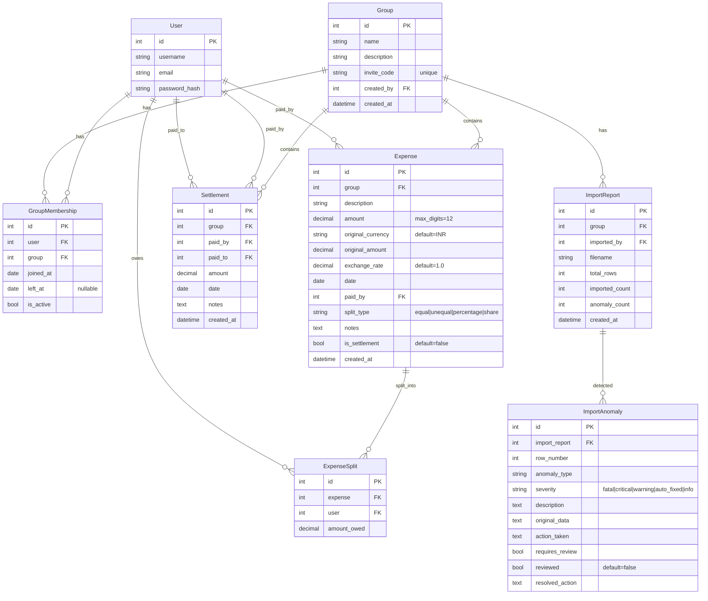

# SCOPE.md — Anomaly Log & Database Schema

## 📋 CSV Anomaly Log

The CSV file `expenses_export.csv` contains **43 data rows** (excluding header) tracking shared expenses for flatmates Aisha, Rohan, Priya, Meera (core), Dev (trip guest), and Sam (late joiner). We identified **20 deliberate data problems** across 6 categories.

---

### 🔴 Category 1: Duplicate & Conflicting Entries

| # | CSV Row | Problem | Severity | Detection Method | Action Taken |
|---|---------|---------|----------|-----------------|-------------|
| 1 | 6 & 7 | **Duplicate expense** — "Dinner at Marina Bites" (row 6) and "dinner - marina bites" (row 7). Same date (08-02-2026), same payer (Dev), same amount (₹3200). | 🚨 CRITICAL | Fuzzy string matching on description + exact match on (date, payer, amount) | Keep row 6 (has note "Dev visiting for the weekend"), flag row 7 as duplicate. User must confirm. |
| 2 | 25 & 26 | **Conflicting duplicate** — "Dinner at Thalassa" logged by Aisha (₹2400, row 25) AND "Thalassa dinner" logged by Rohan (₹2450, row 26). Same date, similar description, DIFFERENT payers and amounts. Row 26 notes: "Aisha also logged this I think hers is wrong". | 🚨 CRITICAL | Same-date fuzzy description match with different amounts/payers | Flag both. The note on row 26 suggests row 25 may be incorrect. Present both to user for resolution. |

---

### 🟡 Category 2: Formatting & Normalization Issues

| # | CSV Row | Problem | Severity | Detection Method | Action Taken |
|---|---------|---------|----------|-----------------|-------------|
| 3 | 7 | **Comma in amount** — Amount field is `"1,200"` (quoted, comma as thousands separator) | 🔧 AUTO_FIXED | Regex: strip commas before parsing | Silently parsed as `1200.00`. Logged as auto-fixed. |
| 4 | 9 | **Lowercase payer name** — `priya` instead of `Priya` | 🔧 AUTO_FIXED | Case-insensitive name matching | Normalized to `Priya`. Logged. |
| 5 | 10 | **Excessive decimal precision** — Amount is `899.995` (3 decimal places) | 🔧 AUTO_FIXED | Check decimal places > 2 | Rounded to `900.00` (banker's rounding). Logged. |
| 6 | 11 | **Payer name variant** — `Priya S` instead of `Priya` | ⚠️ WARNING | Fuzzy matching (contains known name as prefix) | Matched to `Priya` with 85%+ confidence. Flagged for user confirmation. |
| 7 | 27 | **Inconsistent date format** — `Mar-14` instead of `DD-MM-YYYY` | 🔧 AUTO_FIXED | Multi-format date parser (dateutil) | Parsed as `14-03-2026`. Logged. |
| 8 | 27 | **Payer name with trailing space** — `rohan ` (trailing space + lowercase) | 🔧 AUTO_FIXED | Strip + case-insensitive match | Trimmed and normalized to `Rohan`. Logged. |

---

### 🔴 Category 3: Missing Data

| # | CSV Row | Problem | Severity | Detection Method | Action Taken |
|---|---------|---------|----------|-----------------|-------------|
| 9 | 13 | **Missing payer** — `paid_by` field is empty for "House cleaning supplies" (₹780) | 💀 FATAL | Empty field check | Cannot import without knowing who paid. Flagged for user to assign payer. Import blocked for this row until resolved. |
| 10 | 28 | **Missing currency** — Currency field is empty for "Groceries DMart" (₹2105) | ⚠️ WARNING | Empty field check | Defaulted to `INR` (the dominant currency in the dataset, 90%+ of entries). Flagged for confirmation. |

---

### 🟠 Category 4: Mathematical & Logic Errors

| # | CSV Row | Problem | Severity | Detection Method | Action Taken |
|---|---------|---------|----------|-----------------|-------------|
| 11 | 15 | **Percentages don't sum to 100%** — Aisha 30% + Rohan 30% + Priya 30% + Meera 20% = **110%** | 🚨 CRITICAL | Sum validation of percentage splits | Flagged. Options: (a) normalize proportionally, (b) ask user to correct. Import blocked until resolved. |
| 12 | 32 | **Percentages don't sum to 100% (again)** — Weekend brunch: same 30/30/30/20 = 110% | 🚨 CRITICAL | Sum validation | Same handling as row 15. |
| 13 | 31 | **Zero amount** — "Dinner order Swiggy" has amount `0`. Note: "counted twice earlier - fixing later" | ⚠️ WARNING | Zero check on amount field | Flagged as likely placeholder/error. Skipped from balance calculation but logged. |
| 14 | 26 | **Negative amount** — "Parasailing refund" has amount `-30` USD | 💡 INFO | Negative amount detection | Treated as a **refund/credit**. The negative reverses part of a prior charge. This is valid behavior, logged for awareness. |

---

### 🔵 Category 5: Structural & Classification Issues

| # | CSV Row | Problem | Severity | Detection Method | Action Taken |
|---|---------|---------|----------|-----------------|-------------|
| 15 | 14 | **Settlement logged as expense** — "Rohan paid Aisha back" (₹5000), no split_type, only Aisha in split_with. Note: "this is a settlement not an expense??" | 🚨 CRITICAL | Keyword detection ("paid back", "settlement") + missing split_type + single person in split_with | Reclassified as a **Settlement** record (Rohan → Aisha, ₹5000). Not included in expense calculations. |
| 16 | 23 | **Non-member in split** — "Dev's friend Kabir" appears in split_with for Parasailing | ⚠️ WARNING | Name not found in known member list | Created `Kabir` as a **guest participant** for this expense only. Flagged for review. |
| 17 | 42 | **Conflicting split metadata** — split_type is `equal` but split_details contains `Aisha 1; Rohan 1; Priya 1; Sam 1`. Note confirms confusion. | 💡 INFO | split_details present when split_type=equal | Since shares are all equal (1:1:1:1), the equal split is honored. split_details ignored. Logged. |

---

### 🟣 Category 6: Temporal & Membership Issues

| # | CSV Row | Problem | Severity | Detection Method | Action Taken |
|---|---------|---------|----------|-----------------|-------------|
| 18 | 34 | **Ambiguous date** — `04-05-2026`. DD-MM format (used elsewhere) = May 4. But note asks "is this April 5 or May 4?" Creating a chronological gap. | 🚨 CRITICAL | Date falls outside expected monthly sequence; user note confirms ambiguity | Flagged for user decision. Parsed as May 4 (DD-MM-YYYY, consistent with rest of CSV) but marked for review. |
| 19 | 36 | **Departed member in split** — Meera appears in April 2 expense split, but she moved out end of March (row 33 note: "Meera moving out Sunday :(") | ⚠️ WARNING | Cross-reference membership dates against expense date | Flagged. Meera's `left_at` is ~2026-03-29. April expenses should not include her. User must confirm removal. |
| 20 | 20-21 | **Foreign currency without exchange rate** — USD amounts (Goa villa $540, beach lunch $84, parasailing $150) mixed with INR expenses | 💡 INFO | Currency field ≠ 'INR' | Applied configurable exchange rate (default: ₹83.50/USD). Stored both `original_amount` + `original_currency` alongside converted INR amount. |

---

## 🗄️ Database Schema

### Entity-Relationship Diagram

### Key Schema Design Decisions

1. **`GroupMembership.joined_at` / `left_at`** — Enables temporal membership tracking. Sam joined mid-April; Meera left end of March. The balance calculator filters expenses by membership window.

2. **`Expense.original_currency` + `exchange_rate`** — Stores the original USD amount AND the conversion rate used, so the calculation is fully auditable and the rate can be changed retroactively.

3. **`Expense.is_settlement`** — Separates settlements from expenses at the model level, so "Rohan paid Aisha back" doesn't pollute expense totals.

4. **`ImportAnomaly.severity`** — Five-level severity scale enables the triage UI:
   - `fatal` — Cannot proceed without user input
   - `critical` — Likely wrong, needs review
   - `warning` — Suspicious, flagged
   - `auto_fixed` — Silently corrected, logged
   - `info` — Informational only

5. **`ExpenseSplit`** — Pre-calculated amount each user owes for each expense. This makes balance queries fast (just SUM the splits) rather than recalculating split logic every time.
